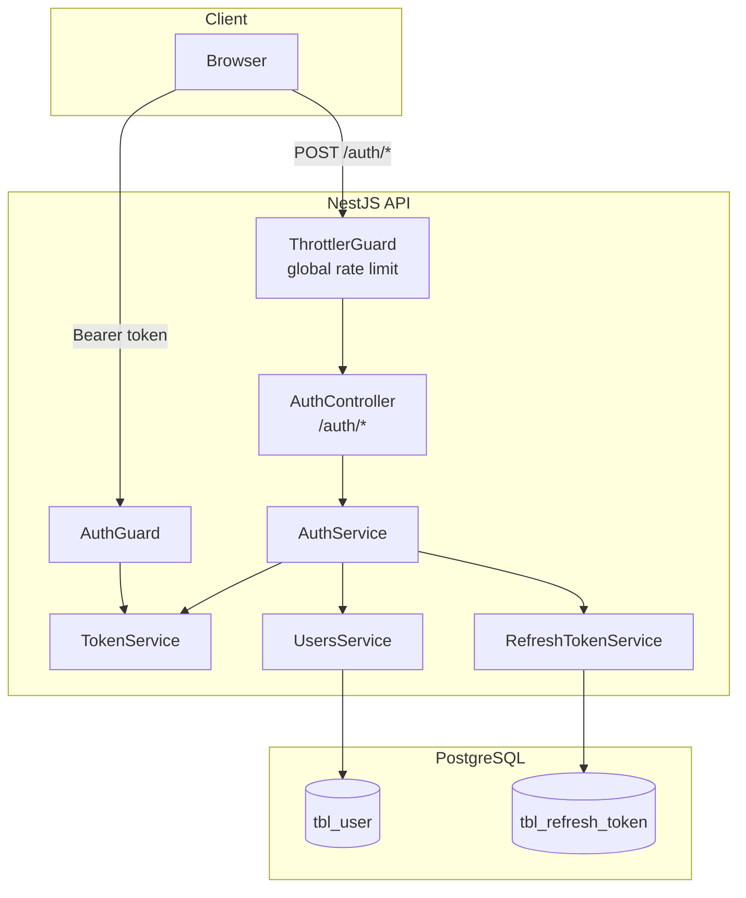
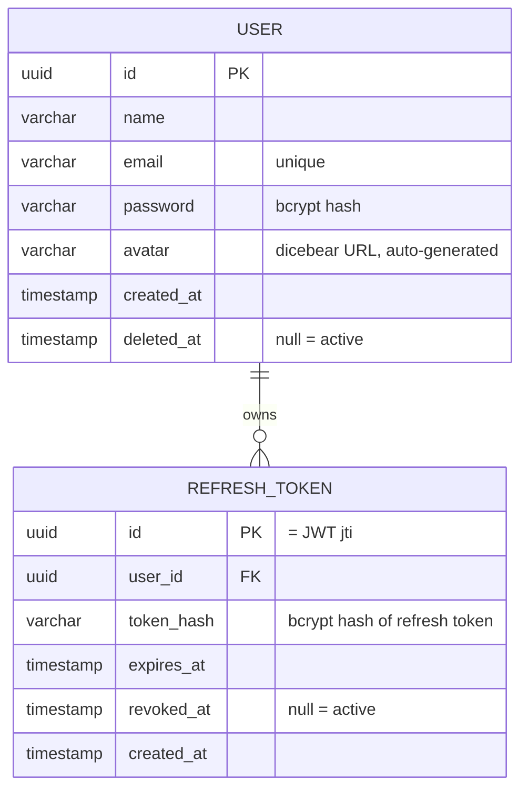
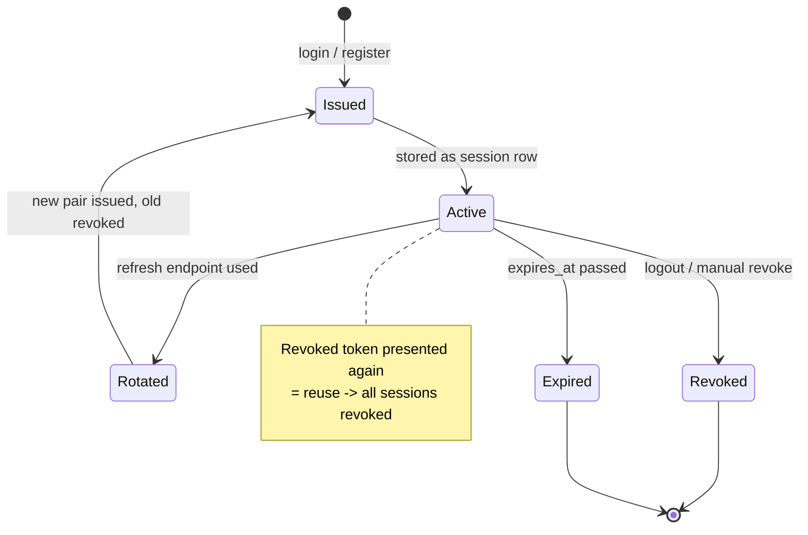

# 01 — Architecture Overview

## Components

| Component | Responsibility |
| --- | --- |
| `AuthController` | HTTP layer for `/auth/*`, applies per-endpoint rate limits, guards `/me`, `/sessions` |
| `AuthService` | Orchestrates register / login / refresh / logout / sessions |
| `TokenService` | Signs and verifies JWTs, hashes refresh tokens, computes expiry |
| `RefreshTokenService` | DB access for session rows (`tbl_refresh_token`) |
| `UsersService` | DB access for `tbl_user`, strips password from user objects |
| `AuthGuard` | Validates the `Bearer` access token on protected routes |
| `ThrottlerGuard` | Global rate limiting; stricter per-endpoint limits on auth routes |

## Data model

Key invariants:

- The refresh token's JWT `jti` claim **equals the session row `id`** — the server can look up a session from a token.
- The raw refresh token is **never stored**. Only its bcrypt hash is kept, so a DB leak cannot be replayed to forge sessions.
- `revoked_at` is set, never deleted — revocation history is preserved for reuse detection.
- Deleting a user cascades to their session rows (`ON DELETE CASCADE`).
- Accounts are **soft deleted** (`deleted_at` set, row kept); deleted users are invisible to login and lookups. See the [users docs](../users/01-overview.md).

## Token lifecycle

## Environment variables

| Variable | Purpose |
| --- | --- |
| `ACCESS_SECRET` | HMAC secret for access JWTs |
| `ACCESS_EXPIRY` | Access token TTL (e.g. `15m`) |
| `REFRESH_SECRET` | HMAC secret for refresh JWTs |
| `REFRESH_EXPIRY` | Refresh token TTL (e.g. `1D`) |
| `CORS_ORIGIN` | Comma-separated allowed origins (default `http://localhost:3000`) |
| `DB_URL` | PostgreSQL connection string |