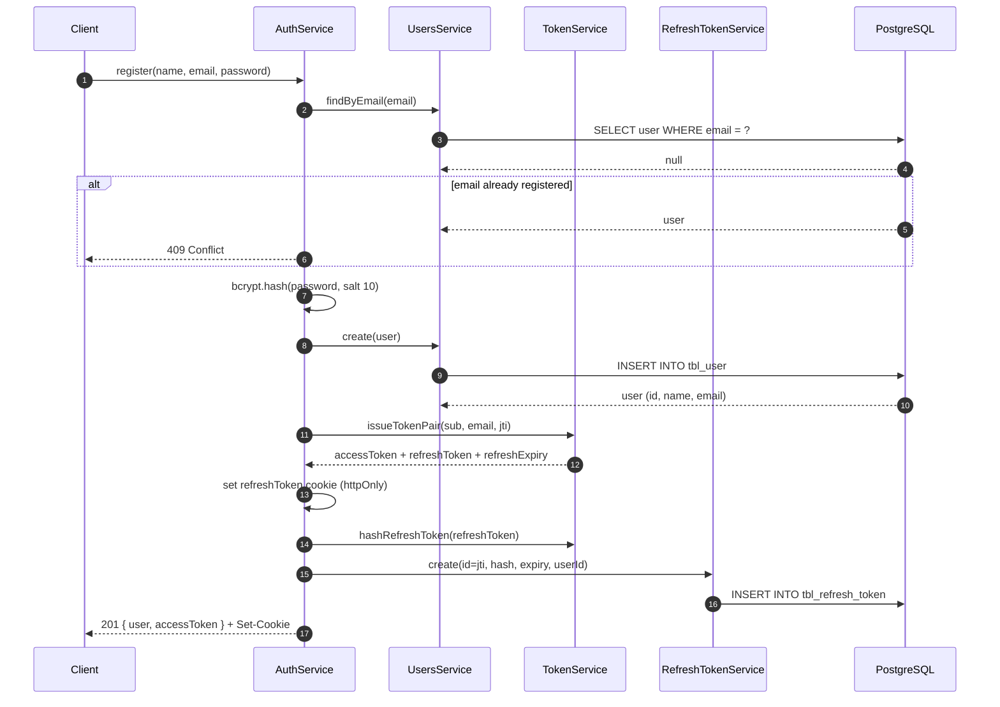
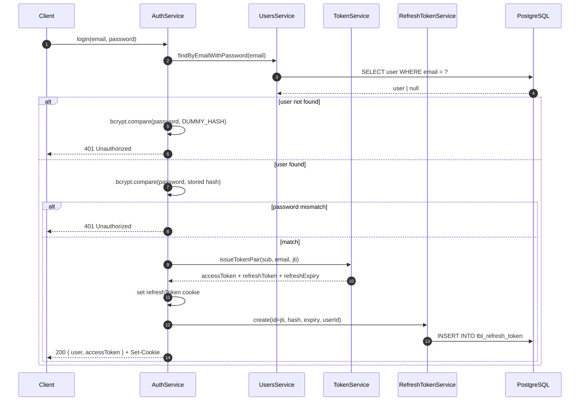
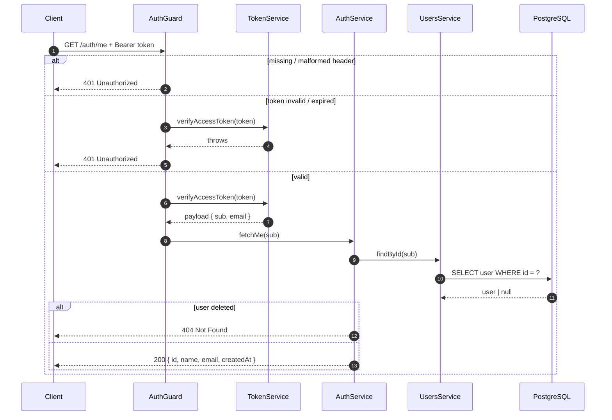

# 02 — Registration & Login

## Register (`POST /auth/register`)

Rate limited: **5 requests / minute**.

**Behavior notes**

- Email uniqueness is checked before insert; duplicates get `409 Conflict`.
- The user is logged in immediately after registration — a session is issued in the same request.
- The response never contains the refresh token — it only travels in the cookie.

## Login (`POST /auth/login`)

Rate limited: **10 requests / minute**.

**Behavior notes**

- Both failure cases return the identical `401 Invalid credentials` message — an attacker cannot distinguish "no such email" from "wrong password" by the response.
- When the email does not exist, bcrypt still runs against a fixed dummy hash so response **timing** is also indistinguishable (prevents user enumeration).
- A failed login attempt is logged as a warning with the attempted email.

## Current user (`GET /auth/me`)

Protected by `AuthGuard` — requires a valid `Authorization: Bearer <accessToken>` header.

**Behavior notes**

- The access token is the only credential here; the refresh cookie is **not** consulted.
- If the account was deleted between token issuance and this call, the API returns `404` (the token itself was valid, the user is gone).
- A rejected token is logged as a warning with the route, for monitoring brute-force scans.