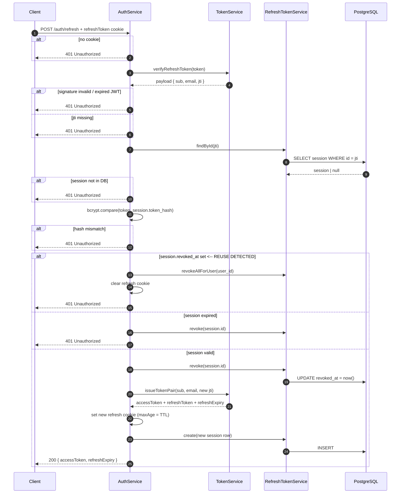
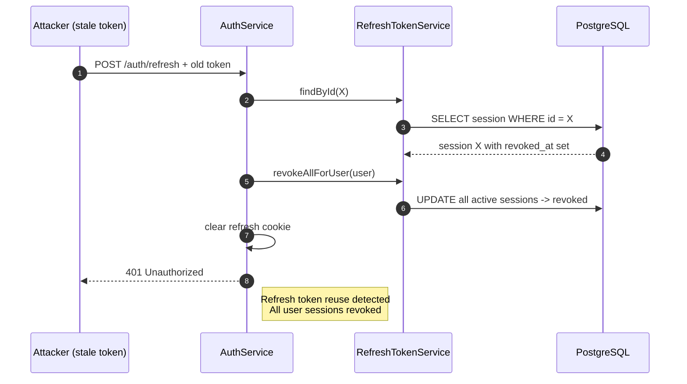

# 03 — Token Refresh & Rotation

## How rotation works

Every call to `POST /auth/refresh` (rate limited: **30 requests / minute**) consumes the presented refresh token and issues a **new pair**. The old refresh token is revoked in the database; the client receives a new cookie.

## Reuse detection (the important scenario)

If a revoked refresh token is ever presented again — a sign the token was **stolen** (the legitimate client has already rotated past it) — the server treats it as a credential compromise and kills **every active session** of that user.

**Why revoke everything?** The stolen token and the legitimate client's current token are indistinguishable — an attacker could be sitting in the middle of the rotation. Revoking all sessions forces a full re-login and invalidates the attacker in one shot.

## Client expectations

1. Keep the `refreshToken` cookie — it is `httpOnly`, the client never reads it.
2. On `401` from the refresh endpoint: session is gone (revoked / reused / expired). The client must **drop local state and redirect to login**.
3. After refresh, the old cookie is replaced in the same response (`Set-Cookie`); the client does nothing special.
4. `refreshExpiry` in the response tells the client how long the new session lasts.