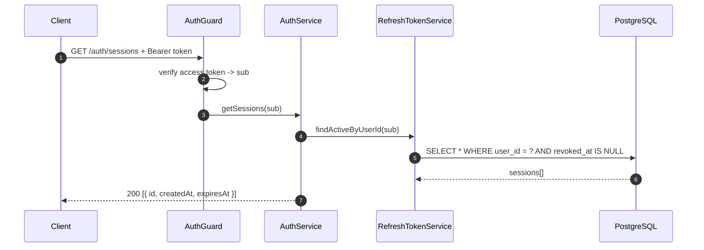
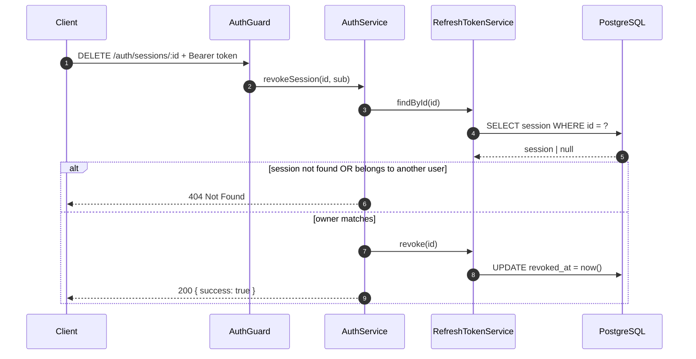
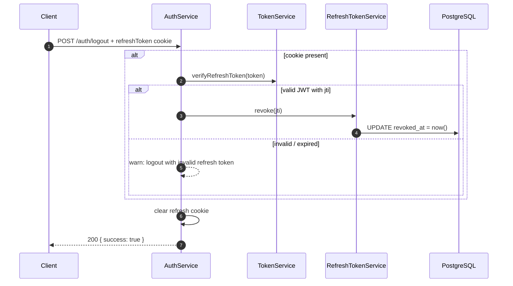

# 04 — Session Management

A **session** = one active row in `tbl_refresh_token`. Each login/register creates one; each refresh rotates to a new one. This document covers inspecting and killing sessions.

## List sessions (`GET /auth/sessions`)

Protected — requires a valid Bearer access token. Returns the caller's **active** (non-revoked, non-expired-in-DB) sessions.



Response shape (per session):

```json
{
  "id": "2fac10aa-...",
  "createdAt": "2026-08-15T08:47:43.541Z",
  "expiresAt": "2026-08-16T08:47:43.000Z"
}
```

`id` is the session's `jti` — the same value a client can use to revoke it.

## Revoke a session (`DELETE /auth/sessions/:id`)

Kills one session. Ownership is enforced server-side — a user can only revoke **their own** sessions.



**Behavior notes**

- Revoking the session the current client is using logs the user out on their next refresh (the cookie token will be rejected as revoked).
- The revoke is logged at `info` with the session and user id — useful for audit.

## Logout (`POST /auth/logout`)

Best-effort: revokes the session tied to the presented cookie, then clears the cookie regardless of outcome.



**Behavior notes**

- Logout never fails: even a tampered/expired cookie yields `200 { success: true }` with the cookie cleared.
- A logout with an invalid token is logged as a warning — usually harmless (expired cookie), occasionally a signal of tampering.