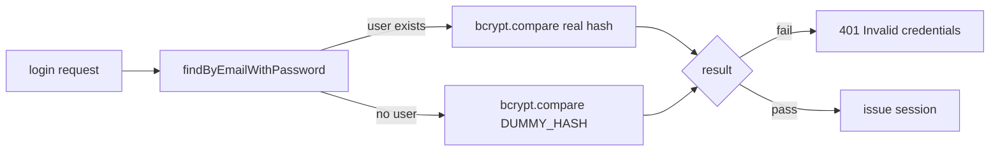

# 05 — Security Measures

Every security decision in the auth system, and why.

## 1. Refresh tokens are hashed at rest

The raw refresh token appears in exactly two places: the client's cookie and the JWT itself. The database stores only a **bcrypt hash** (`token_hash`).

- A DB leak cannot be used to forge sessions.
- Verification is a `bcrypt.compare`, so the hash being slow is actually beneficial here (only one comparison per refresh).

## 2. Refresh token rotation + reuse detection

Every refresh revokes the old session and issues a new one. Presenting an already-revoked token revokes **all** of the user's sessions — see [03-token-refresh.md](03-token-refresh.md). This is the primary defense against stolen cookies: the attacker and victim cannot both keep working, and the victim is alerted by being logged out.

## 3. Timing-safe login

- Identical response body for "no such user" and "wrong password" (`401 Invalid credentials`).
- A fixed dummy hash is compared when the user is missing, so response **timing** does not leak account existence.
- The validation layer rejects malformed input (non-email, short password) before the service is reached.

## 4. Password storage

- `bcrypt` with cost factor 10 (`genSalt(10)`).
- Password policy enforced by DTO: min 8 chars, must contain uppercase, lowercase, and a digit.
- Passwords never leave the service layer: `UsersService.mapUser` strips the hash from every response.

## 5. Cookie hardening

| Attribute | Value | Why |
| --- | --- | --- |
| `httpOnly` | `true` | JavaScript can't read the token → XSS can't exfiltrate it |
| `secure` | only in production | No TLS in dev; avoids breaking localhost |
| `sameSite` | `lax` | Blocks cross-site POSTs carrying the cookie (CSRF mitigation) |
| `path` | `/auth` | Cookie only sent to auth endpoints, reduces exposure |
| `maxAge` | refresh TTL | Browser drops the cookie when the token expires |

## 6. Rate limiting

Global `ThrottlerGuard` (default 100 req/min) with stricter limits on credential endpoints:

| Endpoint | Limit |
| --- | --- |
| `POST /auth/register` | 5 / min |
| `POST /auth/login` | 10 / min |
| `POST /auth/refresh` | 30 / min |
| everything else | 100 / min |

Exceeding a limit returns `429 Too Many Requests`. This throttles credential stuffing and token brute-force.

## 7. Guards

- `AuthGuard` accepts only `Authorization: Bearer <token>`, rejects anything else with `401`.
- Access tokens are verified with the `ACCESS_SECRET`; refresh tokens with the separate `REFRESH_SECRET`. A leaked access secret alone cannot mint refresh tokens.
- Session ownership checks: `revokeSession` verifies the session belongs to the caller.

## 8. Validation

`ValidationPipe` with `whitelist`, `transform`, and `forbidNonWhitelisted` — unknown body fields are rejected outright.

## Known trade-offs

- **No refresh-token per-device metadata** (IP, user agent). Sessions are identifiable only by `id`/timestamps. If needed later, add columns to `tbl_refresh_token` at creation time.
- **Stateless access tokens** mean a revoked session's access token stays valid up to 15 minutes. For immediate kill, the client must clear the token client-side; server-side revocation only affects refresh.