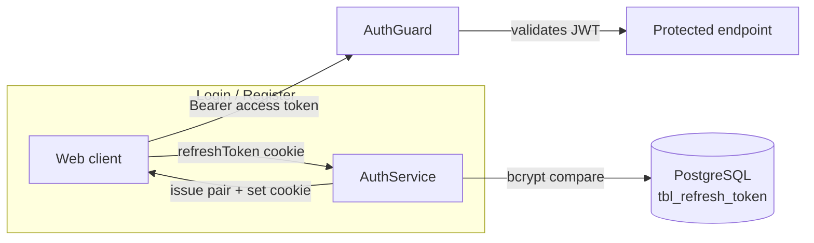

# Auth Documentation

This folder documents the authentication system of the LinkVault API. It is written scenario-first so a new developer can understand **what happens** in each situation, **why**, and **how** to debug it.

## System at a glance

The API uses a **two-token strategy**:

- **Access token** (JWT, 15m): short-lived, sent by the client in the `Authorization: Bearer` header. Stateless — the server never stores it.
- **Refresh token** (JWT, 1 day): long-lived, stored in an `httpOnly` cookie (`refreshToken`), rotated on every use, and stored **hashed** in the database as a session row.

## Documents

| Document | Covers |
| --- | --- |
| [01-overview.md](01-overview.md) | Architecture, components, data model, token lifecycle |
| [02-registration-and-login.md](02-registration-and-login.md) | Register, login, `/me` — happy path and failures |
| [03-token-refresh.md](03-token-refresh.md) | Refresh rotation, expiry, **reuse detection** |
| [04-session-management.md](04-session-management.md) | List sessions, revoke a session, logout |
| [05-security.md](05-security.md) | Rate limiting, cookie flags, hashing, timing attacks |
| [06-observability.md](06-observability.md) | What is logged, where, and why |

## How to read the flows

- Sequence diagrams show the exact request/response order between `Client → Controller → Service → DB`.
- `alt` / `opt` blocks mark conditional branches (the failure cases).
- All diagrams are [Mermaid](https://mermaid.js.org) — rendered automatically on GitHub.