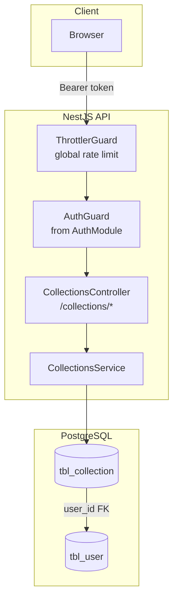
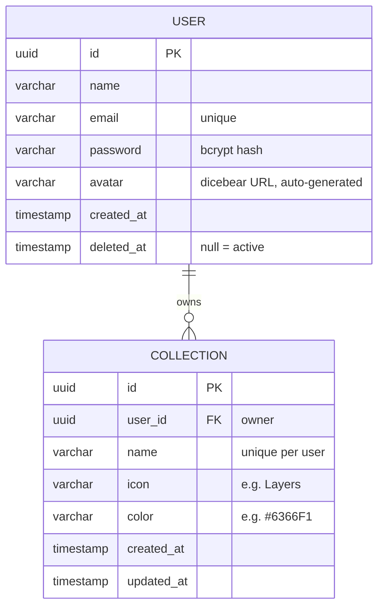

# 01 — Architecture Overview

## Components

| Component | Responsibility |
| --- | --- |
| `CollectionsController` | HTTP layer for `/collections/*`; applies `AuthGuard` to every route; binds `@PaginationParams()` and `@SortingParams()` on the list route; declares the response message per endpoint |
| `CollectionsService` | All DB access for `tbl_collection`; owns create / list / get / update / delete; maps rows to camelCase responses |
| `AuthGuard` | Reused from the auth module — validates the `Bearer` access token (see [auth overview](../auth/01-overview.md)) |
| `@PaginationParams()` | Shared decorator (`src/common/pagination/pagination.decorator.ts`) — reads and validates `page` / `limit`, computes `offset` (see [03-pagination.md](03-pagination.md)) |
| `@SortingParams()` | Shared decorator (`src/common/sorting/sorting.decorator.ts`) — parses `sort=field:asc|desc` and whitelists fields (see [03-pagination.md](03-pagination.md)) |
| `TransformInterceptor` | Global — unwraps paginated service results into `data` + `meta` in the response envelope |

> **Module wiring note:** `CollectionsModule` imports `AuthModule` to reuse `AuthGuard`. `CollectionsService` is provided only here.

## Data model

Key invariants:

- `(name, user_id)` is **unique** (`uq_collection_name_user`) — a user cannot have two collections with the same name. A duplicate insert fails with `400` via the DB-error mapper (`A collection with this name already exists`).
- Every collection row points at an owner with `user_id` — there are no global or shared collections.
- `idx_collection_user_id` keeps "all collections of one user" queries fast.
- Collections are **hard deleted**: `DELETE` removes the row. There is no soft-delete flag.
- Nothing in this table is ever read without a `user_id` filter — every query includes the owner, so one user can never see or change another user's collections.

## Endpoints

| Method | Route | Auth | Description |
| --- | --- | --- | --- |
| `GET` | `/collections` | Bearer token | List own collections — paginated and sortable |
| `GET` | `/collections/:id` | Bearer token | Get one own collection |
| `POST` | `/collections` | Bearer token | Create a collection |
| `PATCH` | `/collections/:id` | Bearer token | Update one own collection |
| `DELETE` | `/collections/:id` | Bearer token | Delete one own collection |

## Environment variables

None specific to this module. The default collection values are hardcoded in `src/collections/constants/index.ts` (`name: 'General'`, `icon: 'Layers'`, `color: '#6366F1'`).
