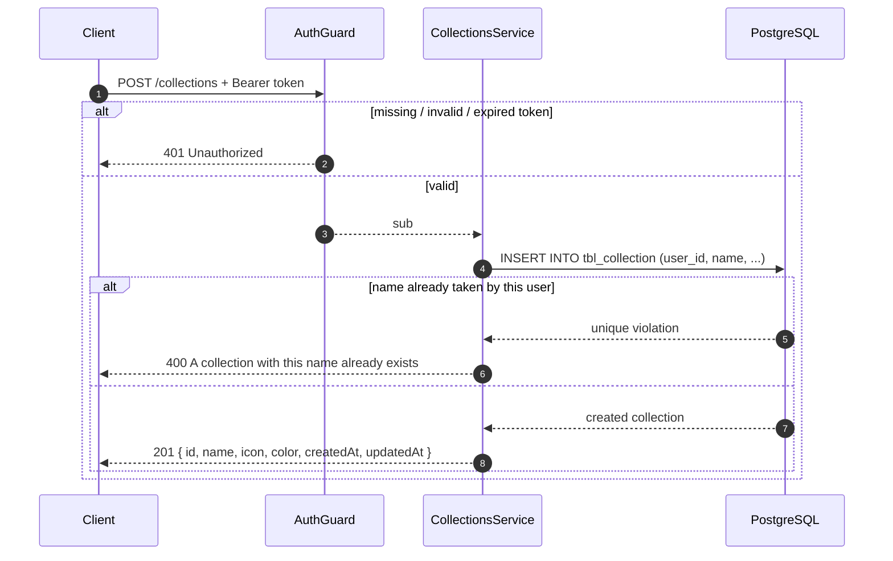
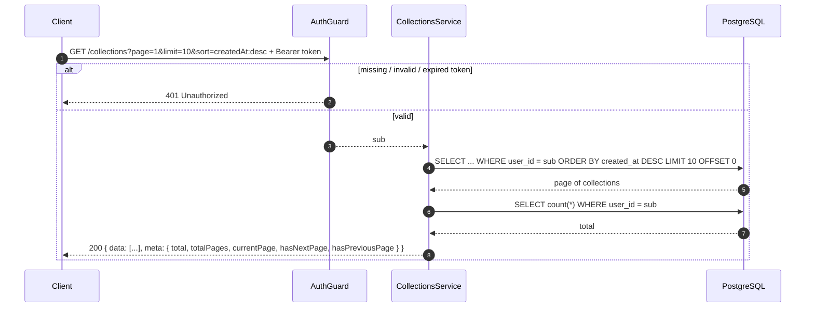
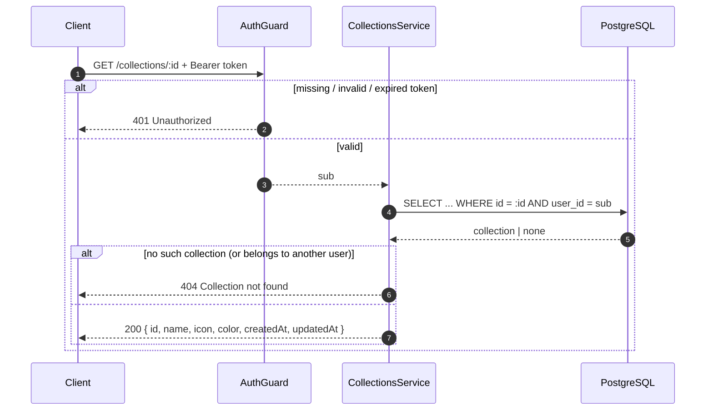
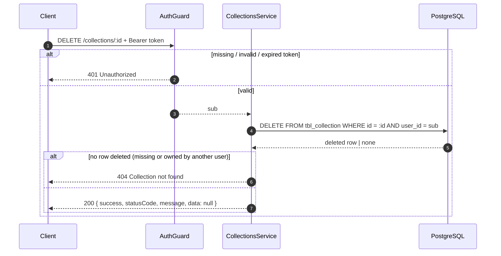

# 02 — Collection Management

All endpoints are protected by `AuthGuard` — they require a valid `Authorization: Bearer <accessToken>` header. The owner is always the caller (`sub` from the token); it never comes from the request body or URL.

Every response is the **mapped** collection in camelCase — `{ id, name, icon, color, createdAt, updatedAt }`. The `user_id` / `created_at` column names never appear.

## Caching

List (`GET /collections`) and single (`GET /collections/:id`) endpoints are cached in Redis using a read-through pattern with write-invalidation:

| Endpoint | Cache Key | TTL | Invalidation |
| --- | --- | --- | --- |
| `GET /collections` | `collection:list:{userId}:p:{page}:l:{limit}:s:{sort}:{filters}` | 5 min | On any collection create/update/delete |
| `GET /collections/:id` | `collection:{userId}:{id}` | 5 min | On that collection update/delete |

Cache invalidation uses prefix deletion for list keys (`collection:list:{userId}:*`) and exact key deletion for single items. Cache operations are non-blocking — errors are logged and the request continues.

## Create (`POST /collections`)

Payload:

```json
{
  "name": "Work",
  "icon": "Briefcase",
  "color": "#0EA5E9"
}
```

Only `name` is required (3–255 characters). `icon` (max 100 chars) and `color` (max 10 chars) are optional. Unknown fields are rejected with `400` by the global validation pipe.



**Behavior notes**

- A duplicate name for the **same user** is rejected with `400` (the DB unique constraint is mapped to a friendly message — see [db error handling](../auth/README.md) for the error shape). The same name from a different user is fine.
- The response is the camelCase-mapped collection — no `user_id`, `created_at`, or `updated_at` in snake_case.

## List (`GET /collections`)

Paginated list of the caller's collections. Pass `page`, `limit`, and `sort` as query params; all are optional (see [03-pagination.md](03-pagination.md) for defaults, validation, and shape). Without a `sort` param the list is ordered by `created_at DESC` (newest first).



Both queries run in parallel (`Promise.all`) — one for the page, one for the total count. Sorting is applied before pagination, and both are always scoped by the caller's `user_id`, so a user can never see someone else's collections.

## Get one (`GET /collections/:id`)



**Behavior notes**

- The query filters by **both** id and owner. A collection that exists but belongs to another user is indistinguishable from a missing one — both return `404`. This leaks nothing about other users' data.

## Update (`PATCH /collections/:id`)

Same payload rules as create, but every field is optional. Send only the fields you want to change.

```mermaid
sequenceDiagram
    autonumber
    participant C as Client
    participant G as AuthGuard
    participant S as CollectionsService
    participant DB as PostgreSQL

    C->>G: PATCH /collections/:id + Bearer token
    alt missing / invalid / expired token
        G-->>C: 401 Unauthorized
    else valid
        G-->>S: sub
        S->>DB: UPDATE tbl_collection SET ..., updated_at = now()
            WHERE id = :id AND user_id = sub
        DB-->>S: updated collection | none
        alt no row updated (missing or owned by another user)
            S-->>C: 404 Collection not found
        else
            S-->>C: 200 { id, name, icon, color, createdAt, updatedAt }
        end
    end
```

**Behavior notes**

- The single update query checks owner, so updating another user's collection is impossible — same `404` as the get-by-id case.
- `updated_at` is always bumped to `now()`, even if the payload matches the current values.
- An empty body `{}` succeeds and returns the row unchanged (unlike `PATCH /users/me`, which rejects it).

## Delete (`DELETE /collections/:id`)

Hard delete — the row is removed, there is no soft-delete flag.



**Behavior notes**

- Unlike account deletion (`DELETE /users/me`), deleting a collection is **not idempotent**: deleting the same id twice returns `404` the second time.
- The response is the standard envelope with `data: null` — there is no deleted row in the response body.

## Request summary

| Method | Route | Success | Errors |
| --- | --- | --- | --- |
| `POST` | `/collections` | `201` created collection | `400` invalid body / duplicate name, `401` |
| `GET` | `/collections` | `200` `{ data, meta }` | `400` invalid `page`/`limit`, `401` |
| `GET` | `/collections/:id` | `200` collection | `401`, `404` |
| `PATCH` | `/collections/:id` | `200` updated collection | `400` invalid body, `401`, `404` |
| `DELETE` | `/collections/:id` | `200` `data: null` | `401`, `404` |
