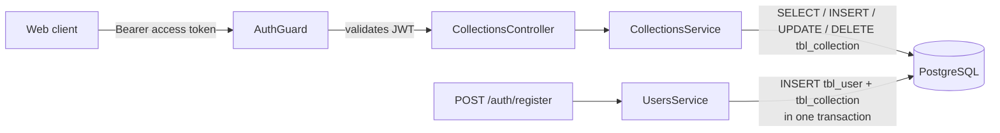

# Collections Documentation

This folder documents the collections feature of the LinkVault API. Same scenario-first style as the [auth docs](../auth/README.md) and [users docs](../users/README.md): a new developer can understand **what happens** in each situation, **why**, and **how to debug it**.

## System at a glance

Collections live under `/collections/*` and were the first feature to use the shared pagination **and** sorting decorators (links reuse the same ones — see the [links docs](../links/README.md)):

- Every endpoint is guarded by `AuthGuard` — a valid `Authorization: Bearer <accessToken>` header is required.
- Every collection belongs to exactly one user. The owner comes from the token (`sub`), never from the request body or URL.
- A user can create, list, update, and delete their own collections. Nothing here can touch another user's data.
- Every user starts with a default **General** collection, created automatically at registration — see [when it is created](#the-default-collection).
- `GET /collections` is paginated and sortable via the shared `page` / `limit` / `sort` parameters — see [03-pagination.md](03-pagination.md).

## Response envelope

Same envelope as everywhere else, wrapped by the global `TransformInterceptor`. **Paginated** endpoints add a `meta` object next to `data`:

```json
{
  "success": true,
  "statusCode": 200,
  "message": "Collections fetched successfully",
  "data": [ ],
  "meta": {
    "total": 3,
    "totalPages": 1,
    "currentPage": 1,
    "hasNextPage": false,
    "hasPreviousPage": false
  }
}
```

Non-paginated endpoints return the envelope without `meta` (like `PATCH /users/me`).

Collection payloads are **mapped to camelCase** before they leave the service — fields are `id`, `name`, `icon`, `color`, `createdAt`, and `updatedAt`. The raw `user_id` / `created_at` column names never reach the client.

## The default collection

At registration, `UsersService` creates the user **and** a first collection named **General** (icon `Layers`, color `#6366F1`) inside a single database transaction — if either insert fails, both are rolled back. The default is defined in `src/collections/constants/index.ts`.



## Documents

| Document | Covers |
| --- | --- |
| [01-overview.md](01-overview.md) | Components, data model, endpoints, ownership rules |
| [02-collection-management.md](02-collection-management.md) | Create, list, get, update, delete — happy path and failures |
| [03-pagination.md](03-pagination.md) | How pagination and sorting work: query params, defaults, response shape |
| [04-observability.md](04-observability.md) | What is logged in the collections module, where, and why |

## How to read the flows

- Sequence diagrams show the exact request/response order between `Client → Controller → Service → DB`.
- `alt` / `opt` blocks mark conditional branches (the failure cases).
- Response payloads in the diagrams are the `data` field of the envelope described above.
- All diagrams are [Mermaid](https://mermaid.js.org) — rendered automatically on GitHub.
- For how the access token is validated and refreshed, see the [auth docs](../auth/README.md).
