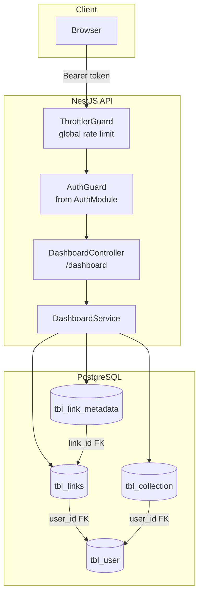
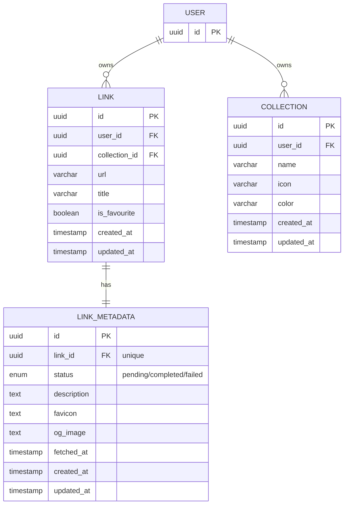

# 01 — Architecture Overview

## Components

| Component | Responsibility |
| --- | --- |
| `DashboardController` | HTTP layer for `GET /dashboard`; applies `AuthGuard`; declares response message |
| `DashboardService` | All DB access for dashboard; aggregates stats and recent activity in parallel |
| `AuthGuard` | Reused from the auth module — validates the `Bearer` access token (see [auth overview](../auth/01-overview.md)) |

## Data model

The dashboard aggregates data from three tables:

Key invariants:

- Every query includes `user_id = sub` — a user never sees another user's data
- `innerJoin` between `tbl_links` and `tbl_link_metadata` — every link has exactly one metadata row (created at link creation)
- Aggregations run in parallel (`Promise.all`) for performance

## Endpoints

| Method | Route | Auth | Description |
| --- | --- | --- | --- |
| `GET` | `/dashboard` | Bearer token | Get aggregated dashboard data |

## Environment variables

None specific to this module.