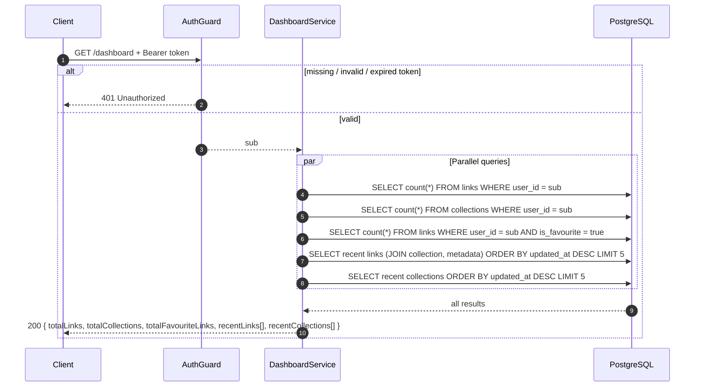

# 02 — Dashboard Data

The dashboard endpoint is protected by `AuthGuard` — it requires a valid `Authorization: Bearer <accessToken>` header. The owner is always the caller (`sub` from the token); it never comes from the request body or URL.

## Get Dashboard (`GET /dashboard`)



**Behavior notes**

- All five queries run in parallel via `Promise.all` — total latency ≈ slowest single query
- Recent links use `innerJoin` on both `tbl_collection` and `tbl_link_metadata` — every link has a collection and a metadata row (created at link creation)
- Links ordered by `updated_at DESC` so the most recently modified appear first
- Collections ordered by `updated_at DESC`
- Limits are constants: `RECENT_LINKS_LIMIT = 5`, `RECENT_COLLECTION_LIMIT = 5`

## Response shape

```json
{
  "success": true,
  "statusCode": 200,
  "message": "Dashboard data fetched successfully",
  "data": {
    "totalLinks": 42,
    "totalCollections": 5,
    "totalFavouriteLinks": 12,
    "recentLinks": [
      {
        "id": "8f2b1c3e-...",
        "title": "Example blog",
        "url": "https://example.com/blog",
        "isFavourite": true,
        "collection": { "id": "3f2a9c1e-...", "name": "Work" },
        "metadata": {
          "status": "completed",
          "description": "Writing about software.",
          "favicon": "https://example.com/favicon.ico",
          "ogImage": "https://example.com/og.png"
        },
        "createdAt": "2026-08-19T10:00:00.000Z",
        "updatedAt": "2026-08-20T14:30:00.000Z"
      }
    ],
    "recentCollections": [
      {
        "id": "3f2a9c1e-...",
        "name": "Work",
        "icon": "Briefcase",
        "color": "#0EA5E9",
        "createdAt": "2026-08-18T08:00:00.000Z",
        "updatedAt": "2026-08-18T08:00:00.000Z"
      }
    ]
  }
}
```

## Request summary

| Method | Route | Success | Errors |
| --- | --- | --- | --- |
| `GET` | `/dashboard` | `200` aggregated data | `401` unauthorized |

## Edge cases

- **User with no links/collections**: returns zeros and empty arrays — not an error
- **Favourites count**: only counts links where `is_favourite = true`
- **Metadata status**: can be `pending`, `completed`, or `failed` — shown directly in recent links