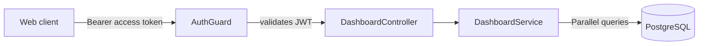

# Dashboard Documentation

This folder documents the dashboard feature of the LinkVault API. It follows the same scenario-first style as the [auth docs](../auth/README.md), [users docs](../users/README.md), [collections docs](../collections/README.md), and [links docs](../links/README.md): a new developer can understand **what happens** in each situation, **why**, and **how** to debug it.

## System at a glance

The dashboard provides a quick overview of a user's link vault:

- Single endpoint: `GET /dashboard`
- Protected by `AuthGuard` — requires valid `Authorization: Bearer <accessToken>`
- Returns aggregated stats and recent activity in one request
- Every user sees only their own data



## Response envelope

Same envelope as everywhere else, wrapped by the global `TransformInterceptor`:

```json
{
  "success": true,
  "statusCode": 200,
  "message": "Dashboard data fetched successfully",
  "data": {
    "totalLinks": 42,
    "totalCollections": 5,
    "totalFavouriteLinks": 12,
    "recentLinks": [ ],
    "recentCollections": [ ]
  }
}
```

## Documents

| Document | Covers |
| --- | --- |
| [01-overview.md](01-overview.md) | Components, data model, endpoint, ownership rules |
| [02-dashboard-data.md](02-dashboard-data.md) | Get dashboard — happy path and failures |
| [03-observability.md](03-observability.md) | What is logged in the dashboard module, where, and why |

## How to read the flows

- Sequence diagrams show the exact request/response order between `Client → Controller → Service → DB`.
- `alt` / `opt` blocks mark conditional branches (the failure cases).
- Response payloads in the diagrams are the `data` field of the envelope described above.
- All diagrams are [Mermaid](https://mermaid.js.org) — rendered automatically on GitHub.
- For how the access token is validated and refreshed, see the [auth docs](../auth/README.md).