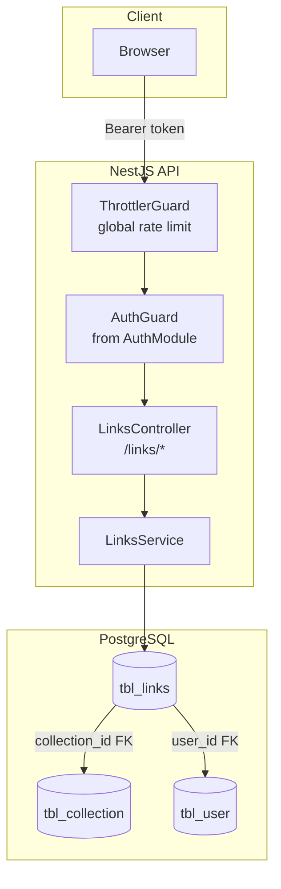
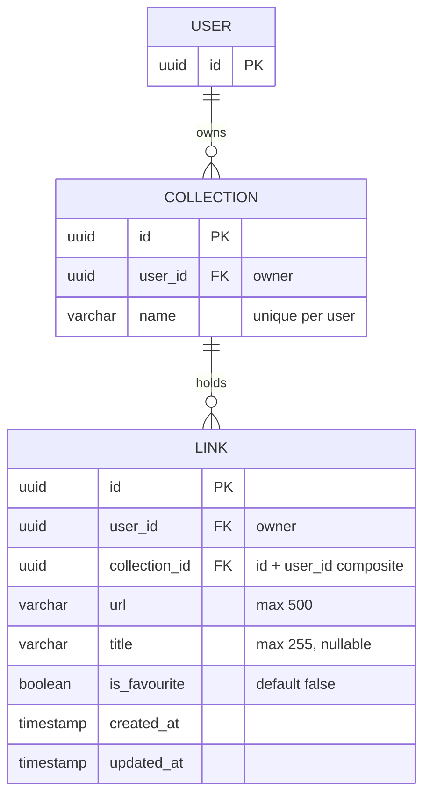

# 01 — Architecture Overview

## Components

| Component | Responsibility |
| --- | --- |
| `LinksController` | HTTP layer for `/links/*`; applies `AuthGuard` to every route; binds `@PaginationParams()`, `@SortingParams()` and the `LinkQueryDto` on the list route |
| `LinksService` | All DB access for `tbl_links`; owns create / list / get / update / mark-favourite / delete; maps rows to camelCase responses |
| `AuthGuard` | Reused from the auth module — validates the `Bearer` access token (see [auth overview](../auth/01-overview.md)) |
| `@PaginationParams()` | Shared decorator (`src/common/pagination/pagination.decorator.ts`) — reads and validates `page` / `limit`, computes `offset` (see [03](03-pagination-sorting-filtering.md)) |
| `@SortingParams()` | Shared decorator (`src/common/sorting/sorting.decorator.ts`) — parses `sort=field:asc|desc` and whitelists fields (see [03](03-pagination-sorting-filtering.md)) |
| `TransformInterceptor` | Global — unwraps paginated service results into `data` + `meta` in the response envelope |

> **Module wiring note:** `LinksModule` imports `AuthModule` to reuse `AuthGuard`. `LinksService` is provided only here.

## Data model

Key invariants:

- Every link points at a user with `user_id` and at one of that user's collections. The FK is **composite** — `(collection_id, user_id)` references `tbl_collection (id, user_id)` (`fk_link_collection_owner`) — so a link can never be attached to another user's collection. Violating it maps to `401 Invalid collection owner`.
- `url` is required (max 500 chars); `title` is optional (max 255 chars).
- `is_favourite` defaults to `false` and is a plain boolean — no separate favourite table.
- `idx_link_user_created` keeps "all links of one user, newest first" queries fast; `idx_link_collection` covers the collection filter.
- Links are **hard deleted**: `DELETE` removes the row. There is no soft-delete flag.
- Every link has exactly one row in `tbl_link_metadata` (created in the same transaction, cascade-deleted with the link) that carries its extracted `description` / `favicon` / `og_image` and an extraction `status` — see the [metadata docs](../metadata/01-overview.md).
- Nothing is ever read without a `user_id` filter — every query includes the owner, so one user can never see or change another user's links.

## Endpoints

| Method | Route | Auth | Description |
| --- | --- | --- | --- |
| `GET` | `/links` | Bearer token | List own links — paginated, sortable, filterable |
| `GET` | `/links/:id` | Bearer token | Get one own link |
| `POST` | `/links` | Bearer token | Create a link |
| `PATCH` | `/links/:id` | Bearer token | Update one own link |
| `PATCH` | `/links/:id/favourite` | Bearer token | Toggle favourite flag on one own link |
| `DELETE` | `/links/:id` | Bearer token | Delete one own link |

## Environment variables

None specific to this module. Deleting a collection with links is blocked by the database (the composite FK prevents it), not by application code.