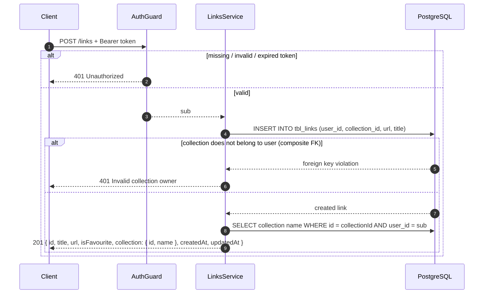
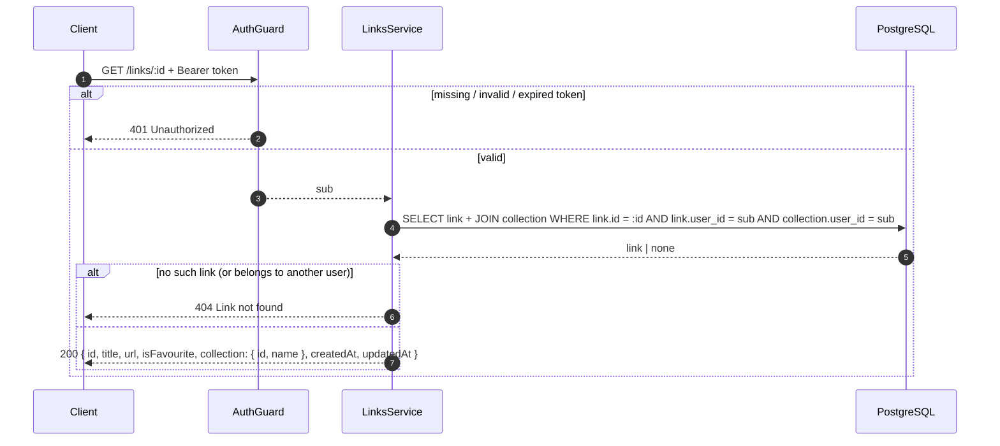
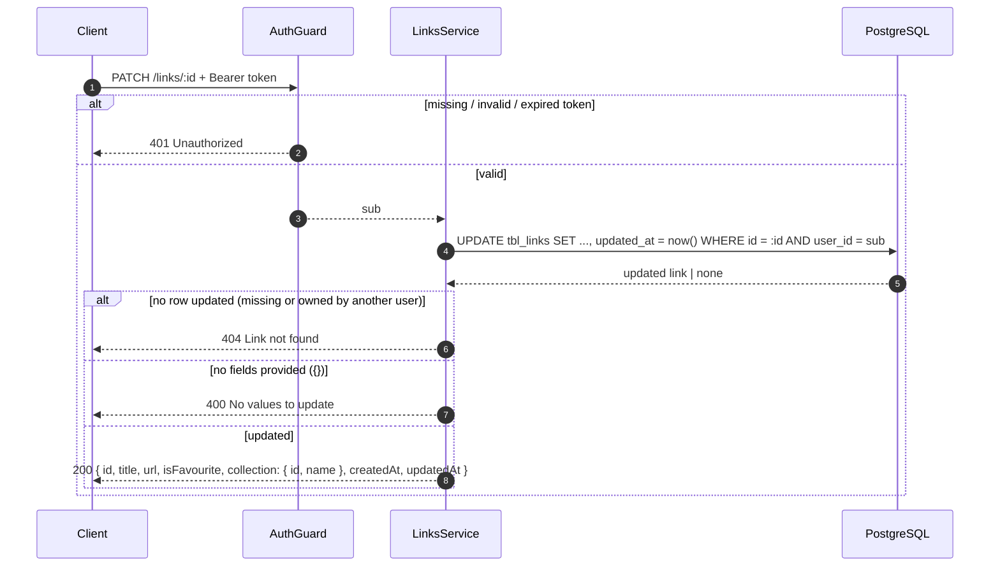
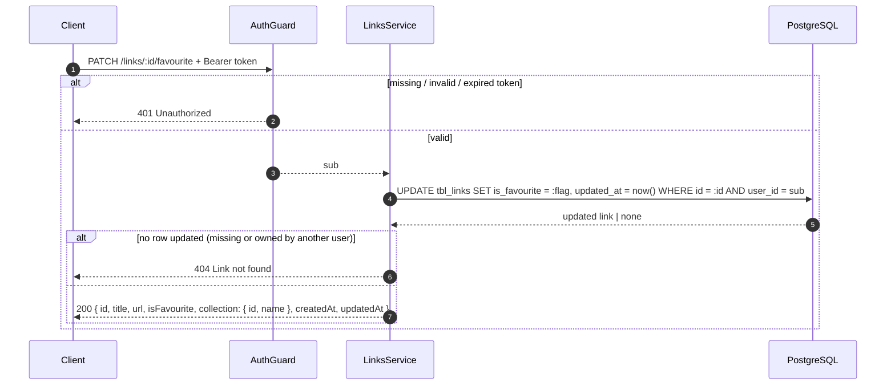
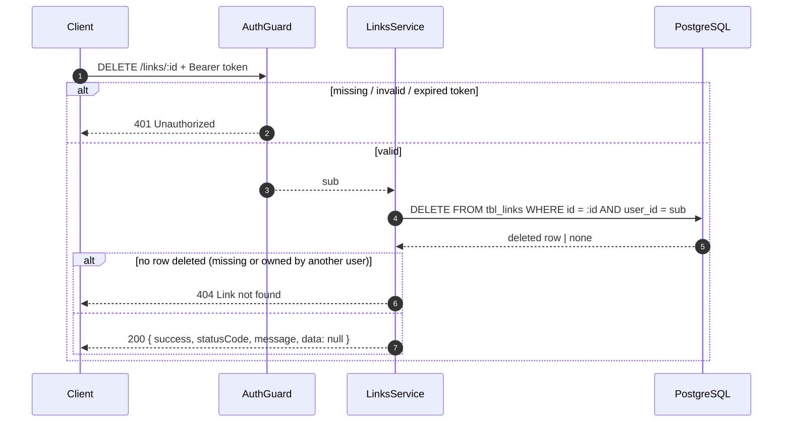

# 02 — Link Management

All endpoints are protected by `AuthGuard` — they require a valid `Authorization: Bearer <accessToken>` header. The owner is always the caller (`sub` from the token); it never comes from the request body or URL.

Every response is the **mapped** link in camelCase — `{ id, title, url, isFavourite, collection: { id, name }, createdAt, updatedAt }`. The `user_id` / `collection_id` / `is_favourite` column names never appear.

## Create (`POST /links`)

Payload:

```json
{
  "url": "https://example.com/blog",
  "title": "Example blog",
  "collectionId": "3f2a9c1e-..."
}
```

Only `url` and `collectionId` are required. `title` is optional. Unknown fields are rejected with `400` by the global validation pipe.



**Behavior notes**

- The composite FK `(collection_id, user_id)` guarantees the collection exists **and** belongs to the caller. Passing someone else's `collectionId` fails with `401 Invalid collection owner` via the DB-error mapper — not a generic `400`.
- The response joins the collection name, so the client gets `collection: { id, name }` right after create.

## Get one (`GET /links/:id`)



**Behavior notes**

- The query filters by **both** id and owner. A link that exists but belongs to another user is indistinguishable from a missing one — both return `404`. This leaks nothing about other users' data.

## Update (`PATCH /links/:id`)

Every field is optional — send only the fields you want to change.



**Behavior notes**

- The single update query checks owner, so updating another user's link is impossible — same `404` as the get-by-id case.
- An empty body `{}` is rejected with `400 No values to update` and a warning is logged.
- If `collectionId` is changed, the composite FK is checked again — a collection that is not the caller's fails with `401 Invalid collection owner`.
- `updated_at` is always bumped to `now()`, even if the payload matches the current values.

## Mark favourite (`PATCH /links/:id/favourite`)

A dedicated toggle so the client doesn't have to send the whole link.

```json
{
  "isFavourite": true
}
```



**Behavior notes**

- Setting the same value twice is a no-op success — the endpoint is idempotent.
- The response mirrors a regular update so the client can refresh its local list item in one round-trip.

## Delete (`DELETE /links/:id`)

Hard delete — the row is removed, there is no soft-delete flag.



**Behavior notes**

- Deleting is **not idempotent**: deleting the same id twice returns `404` the second time.
- The response is the standard envelope with `data: null` — there is no deleted row in the response body.
- Links are not counted on the collection; deleting a link never touches the collection row.

## Request summary

| Method | Route | Success | Errors |
| --- | --- | --- | --- |
| `POST` | `/links` | `201` created link | `400` invalid body, `401` missing/invalid token, `401` `Invalid collection owner` |
| `GET` | `/links` | `200` `{ data, meta }` | `400` invalid `page`/`limit`/`sort`, `401` |
| `GET` | `/links/:id` | `200` link | `401`, `404` |
| `PATCH` | `/links/:id` | `200` updated link | `400` invalid body / empty body, `401`, `404` |
| `PATCH` | `/links/:id/favourite` | `200` updated link | `400` invalid body, `401`, `404` |
| `DELETE` | `/links/:id` | `200` `data: null` | `401`, `404` |