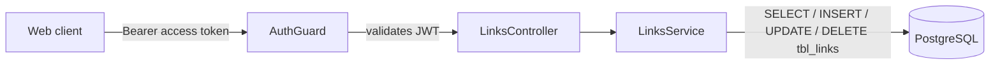

# Links Documentation

This folder documents the links feature of the LinkVault API. It follows the same scenario-first style as the [auth](../auth/README.md), [users](../users/README.md), and [collections](../collections/README.md) docs: a new developer can understand **what happens** in each situation, **why**, and **how** to debug it.

## System at a glance

Links (bookmarks) live under `/links/*` and build on the collections feature:

- Every endpoint is guarded by `AuthGuard` — a valid `Authorization: Bearer <accessToken>` header is required.
- Every link belongs to exactly one user and one of that user's collections. The owner comes from the token (`sub`), never from the request body or URL.
- A user can create, list, get, update, favourite, and delete their own links. Nothing here can touch another user's data.
- `GET /links` is paginated, sortable, and filterable: `search`, `isFavourite`, and `collectionId` filters, plus the shared `page` / `limit` / `sort` parameters. The pagination and sorting helpers are shared with collections — see [03-pagination-sorting-filtering.md](03-pagination-sorting-filtering.md).
- A link can be flagged as a favourite (`isFavourite`, default `false`) and toggled without a full update via `PATCH /links/:id/favourite`.

## Response envelope

Same envelope as everywhere else, wrapped by the global `TransformInterceptor`. **Paginated** endpoints add a `meta` object next to `data`:

```json
{
  "success": true,
  "statusCode": 200,
  "message": "Links retrieved successfully",
  "data": [ ],
  "meta": {
    "total": 3,
    "totalPages": 1,
    "currentPage": 1,
    "hasNextPage": false,
    "hasPreviousPage": false
  }
}
```

Non-paginated endpoints return the envelope without `meta` (like `POST /links`).

Link payloads are **mapped to camelCase** before they leave the service — fields are `id`, `title`, `url`, `isFavourite`, a nested `collection` object, a nested `metadata` object (`status`, `description`, `favicon`, `ogImage` — populated in the background, see the [metadata docs](../metadata/README.md)), `createdAt`, and `updatedAt`. The raw `user_id`, `collection_id`, and `is_favourite` column names never reach the client.



## Documents

| Document | Covers |
| --- | --- |
| [01-overview.md](01-overview.md) | Components, data model, endpoints, ownership rules |
| [02-link-management.md](02-link-management.md) | Create, get, update, mark favourite, delete — happy path and failures |
| [03-pagination-sorting-filtering.md](03-pagination-sorting-filtering.md) | `page` / `limit` / `sort` and the `search` / `isFavourite` / `collectionId` filters |
| [04-observability.md](04-observability.md) | What is logged in the links module and globally, where, and why |

## How to read the flows

- Sequence diagrams show the exact request/response order between `Client → Controller → Service → DB`.
- `alt` / `opt` blocks mark conditional branches (the failure cases).
- Response payloads in the diagrams are the `data` field of the envelope described above.
- All diagrams are [Mermaid](https://mermaid.js.org) — rendered automatically on GitHub.
- For how the access token is validated and refreshed, see the [auth docs](../auth/README.md).
- For how collections work (the owner of every link), see the [collections docs](../collections/README.md).