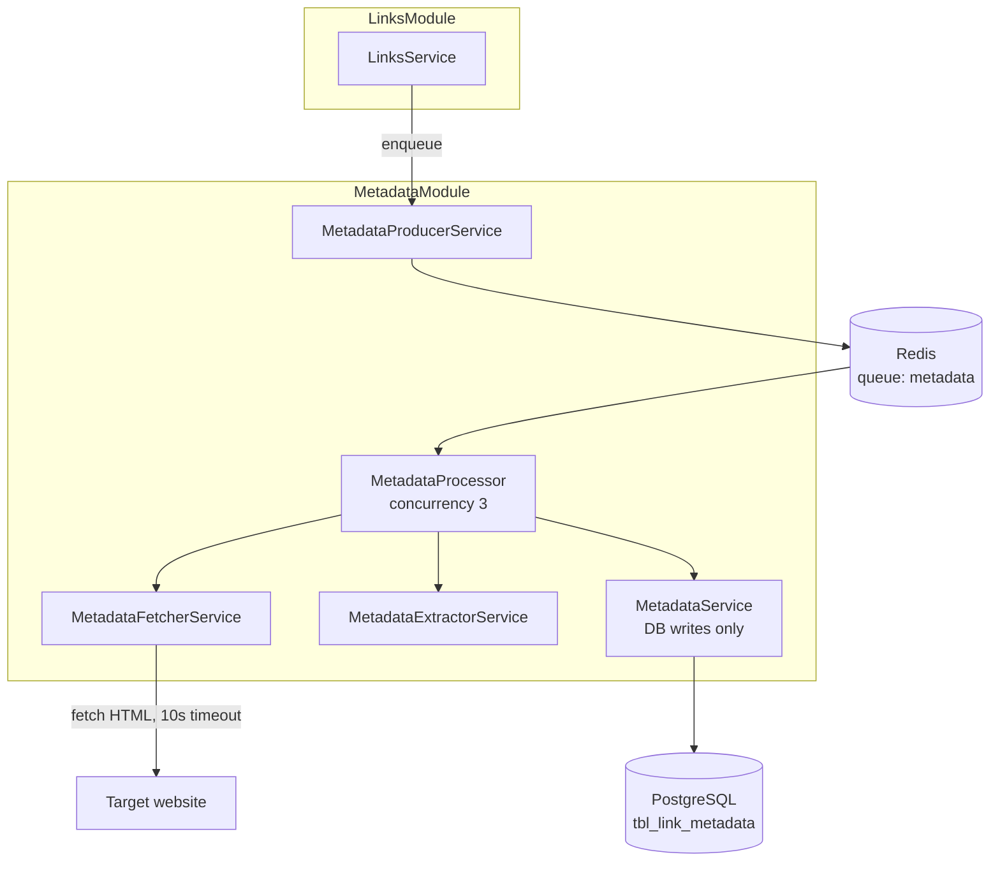
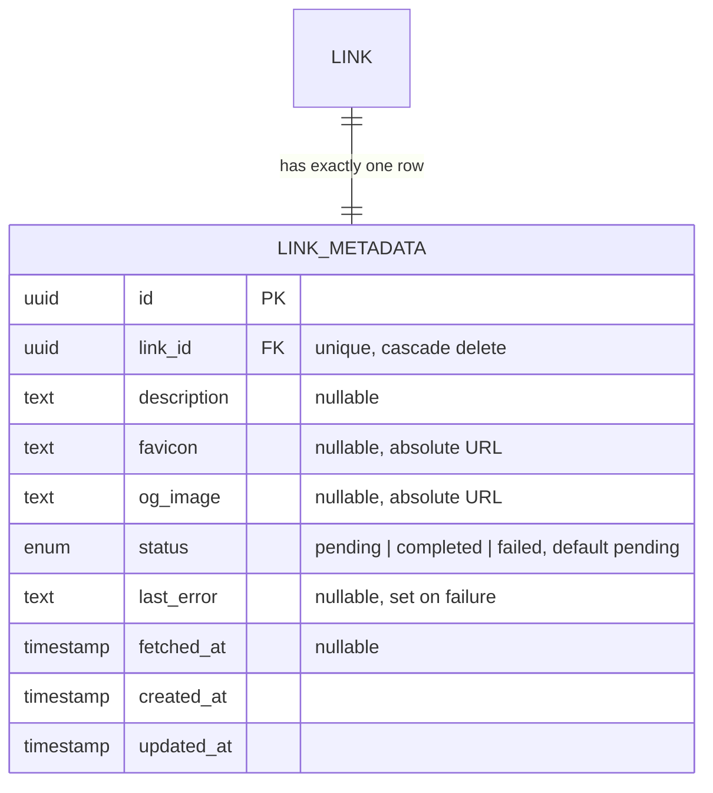

# 01 — Architecture Overview

## Why a queue at all?

Fetching a third-party website from inside `POST /links` would tie the response time to a stranger's server: a slow site (or a 10s timeout) makes link creation feel broken. A queue splits the work:

- The **request path** only writes two rows in one transaction — it is as fast as a normal create.
- The **worker path** absorbs slow sites, timeouts, and retries without the user ever waiting.

## Components

| Component | File | Responsibility |
| --- | --- | --- |
| `MetadataProducerService` | `metadata-producer.service.ts` | The only piece other modules touch. Enqueues jobs with the shared retry options. |
| `MetadataProcessor` | `metadata.processor.ts` | The BullMQ worker (`extends WorkerHost`). Runs up to 3 jobs in parallel, orchestrates fetch → extract → save. |
| `MetadataFetcherService` | `metadata-fetcher.service.ts` | Fetches HTML with a 10s abort timeout, bot User-Agent, and content-type guard. |
| `MetadataExtractorService` | `metadata-extractor.service.ts` | Pure Cheerio extraction — no I/O, no DB. Multiple fallbacks per field. |
| `MetadataService` | `metadata.service.ts` | All writes to `tbl_link_metadata`: `saveSuccess`, `saveFailure`, `resetToPending`. |
| constants | `constants/index.ts` | Queue name, job name, concurrency, timeout, retry/backoff options in one place. |

> **Module wiring note:** `LinksModule` imports `MetadataModule` to use `MetadataProducerService` and `MetadataService`. Metadata never imports links — no cycle. The queue itself is registered in `MetadataModule` via `BullModule.registerQueue`.

## Data model

Key invariants:

- One metadata row per link (`link_id` is `unique`). Created in the **same transaction** as the link, so a link can never exist without a `pending` metadata row.
- Deleting a link cascades to its metadata — no orphan rows.
- All extracted URLs are resolved to **absolute** URLs against the page URL before saving (relative icons like `/favicon.ico` become `https://site.com/favicon.ico`).

## Job configuration

Defined once in `metadata/constants/index.ts`:

| Setting | Value | Why |
| --- | --- | --- |
| Worker concurrency | `3` | Three sites are fetched in parallel; one slow site never blocks the queue. |
| Attempts | `3` | Transient network blips get two more chances. |
| Backoff | exponential, `3s` base | Second attempt after ~3s, third after ~6s. |
| Fetch timeout | `10s` (AbortController) | A hanging site releases the worker slot after 10s. |
| `removeOnComplete` / `removeOnFail` | `100` / `500` | Redis does not grow forever, but failures stay around for debugging. |
| User-Agent | `LinkVaultBot/1.0` | Identifies the bot; some sites block unknown agents. |

## Endpoints

The metadata module intentionally exposes **no HTTP routes**. It is driven entirely by link creation and link URL changes (see [02-extraction-pipeline.md](02-extraction-pipeline.md)), and its results are read back through the normal link endpoints.
