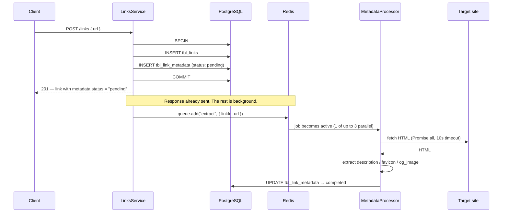
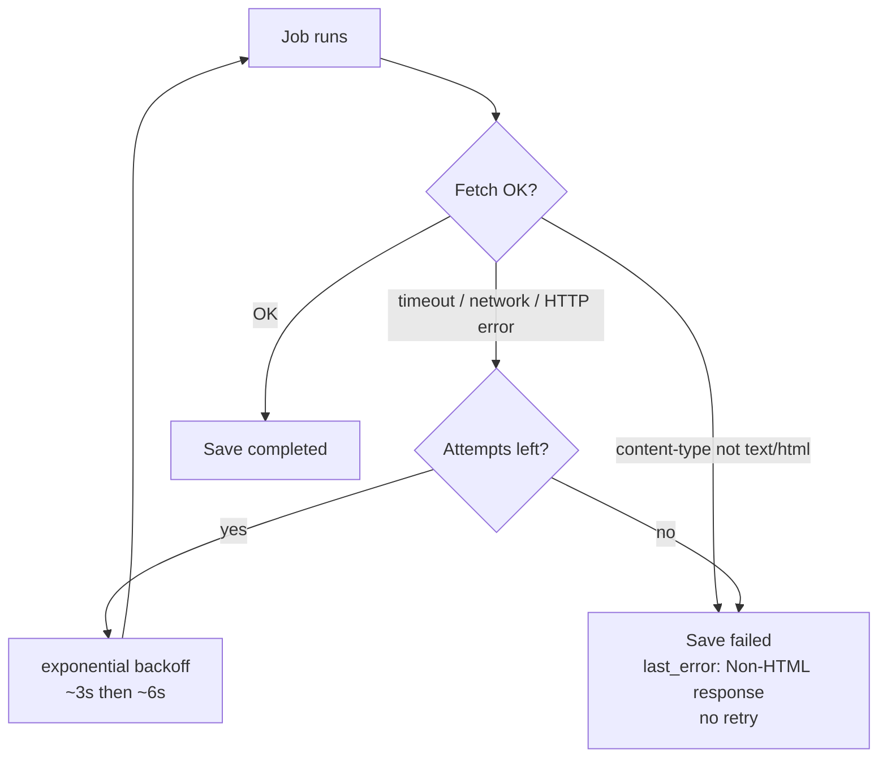

# 02 — Extraction Pipeline

## Create a link → extraction is queued

Two details matter:

- **Transaction scope.** Link row + pending metadata row commit together. If the DB fails, nothing is created and nothing is queued. If only the *queue* is down afterwards, the link exists with a stuck `pending` row — the link is never lost.
- **Enqueue after commit.** The job is only added once the transaction committed, so the worker can never read a row that does not exist yet.

## What the worker does per job

1. **Validate the URL** — an unparseable URL fails immediately, no retries (retrying cannot fix it).
2. **Fetch in parallel** — `Promise.all` runs the page fetch and the favicon-of-last-resort resolution at the same time.
3. **Extract with fallbacks** (Cheerio, no I/O):

   | Field | Fallback order |
   | --- | --- |
   | `description` | `meta[name=description]` → `og:description` → `twitter:description` → `itemprop` → JSON-LD `description` |
   | `og_image` | `og:image` → `og:image:url` / `:secure_url` → `twitter:image` / `:src` → `itemprop` → `link[rel=image_src]` → JSON-LD `primaryImageOfPage` / `image` / `thumbnailUrl` |
   | `favicon` | `link[rel=icon]` → `shortcut icon` → `apple-touch-icon(-precomposed)` → `mask-icon` → convention `/favicon.ico` → DuckDuckGo icon proxy |

   JSON-LD image values can be strings *or* objects (`{ "@type": "ImageObject", "url": … }`) — both are handled. The first fallback wins; nothing is overwritten.

4. **Save** — one `UPDATE` sets the fields, `status: completed`, and `fetched_at`.

## Failure handling

- **Retriable** (network error, HTTP >= 400, timeout): the job rethrows so BullMQ retries with backoff. Only the **final** attempt writes `status: failed` + `last_error`.
- **Not retriable**: non-HTML responses (PDFs, JSON APIs, images) and invalid URLs — the row is marked `failed` immediately. Retrying cannot change what the server returns.

## Re-extraction when a link's URL changes

`PATCH /links/:id` with a new `url`:

1. The link row is updated.
2. The metadata row is reset (`resetToPending` — fields cleared, `status: pending`).
3. A fresh extraction job is enqueued.

The reset happens **before** the enqueue so the worker always starts from a clean row — a fast worker can never race the reset.

## Performance notes

- `GET /links` reads link + collection + metadata in **one joined query** (`innerJoin` on `tbl_link_metadata`) — no N+1 per row. The inner join is safe because every link is created with its metadata row in the same transaction, so the join always matches.
- The list query and the count query run in **`Promise.all`**.
- `markFavourite` fetches the collection and metadata rows in **`Promise.all`** as well.
- `POST /links` does not re-read the metadata row — it was just written as `pending` in the transaction.
