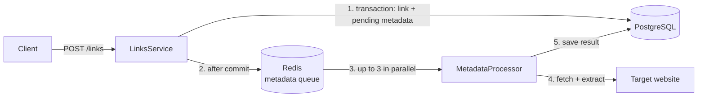

# Metadata Documentation

This folder documents the link metadata feature of the LinkVault API. It follows the same scenario-first style as the [auth](../auth/README.md), [users](../users/README.md), [collections](../collections/README.md), and [links](../links/README.md) docs: a new developer can understand **what happens** in each situation, **why**, and **how to debug it**.

## System at a glance

When a link is created, the API does not wait for the target website. It stores the link immediately, queues a background job, and a worker fetches the page later:

- **Link creation stays fast** — the HTTP response returns as soon as the link row and a `pending` metadata row are committed. No external request happens in the request path.
- **Extraction is asynchronous** — a BullMQ job (backed by Redis) is enqueued right after the transaction commits. A worker picks it up, fetches the page HTML, and extracts `description`, `favicon`, and `og_image`.
- **Only schema fields are extracted** — nothing beyond the `tbl_link_metadata` columns is scraped.
- **Multiple fallbacks per field** — sites differ wildly in what they declare, so every field falls back through OpenGraph → Twitter → itemprop/`link` tags → schema.org JSON-LD → conventions (`/favicon.ico`, icon proxy).
- **Up to 3 jobs run in parallel**; each job retries up to 3 times with exponential backoff.
- **Failures are visible, not silent** — the metadata row ends as `failed` with a `last_error` message, and every queue/worker event is logged.

## The metadata object in link responses

Every link response now carries a nested `metadata` object (see [links docs](../links/README.md) for the full link payload):

```json
{
  "id": "5f0095c4-bb39-440d-8d9c-f2c767732779",
  "title": "Nest",
  "url": "https://github.com/nestjs/nest",
  "isFavourite": false,
  "collection": { "id": "…", "name": "General" },
  "metadata": {
    "status": "completed",
    "description": "A progressive Node.js framework for building efficient, scalable…",
    "favicon": "https://github.githubassets.com/favicons/favicon.svg",
    "ogImage": "https://opengraph.githubassets.com/…"
  },
  "createdAt": "2026-08-22T16:09:13.662Z",
  "updatedAt": "2026-08-22T16:09:13.662Z"
}
```

| `status` | Meaning |
| --- | --- |
| `pending` | Job queued or running — fields are `null`. Poll the link to see it flip to `completed`. |
| `completed` | Extraction succeeded — fields are filled (any of them can still be `null` if the site declares nothing). |
| `failed` | All attempts exhausted — `description` / `favicon` / `ogImage` are `null`; the error is in `last_error` (DB only, not exposed in the API). |



## Documents

| Document | Covers |
| --- | --- |
| [01-overview.md](01-overview.md) | Components, data model, job configuration |
| [02-extraction-pipeline.md](02-extraction-pipeline.md) | Full lifecycle: create → queue → extract → save, retries, re-extraction on URL change |
| [03-observability.md](03-observability.md) | What is logged at every stage and how to debug a stuck/failed extraction |

## How to read the flows

- Sequence diagrams show the exact order between `Client → LinksService → Redis → MetadataProcessor → target site → PostgreSQL`.
- `alt` / `opt` blocks mark conditional branches (retry and failure cases).
- All diagrams are [Mermaid](https://mermaid.js.org) — rendered automatically on GitHub.
- For how links themselves are created and returned, see the [links docs](../links/README.md).
