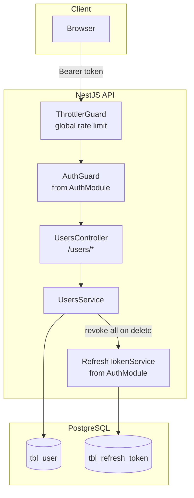
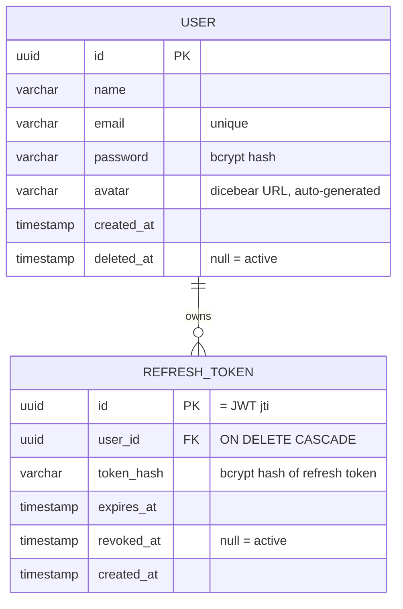

# 01 — Architecture Overview

## Components

| Component | Responsibility |
| --- | --- |
| `UsersController` | HTTP layer for `/users/*`; applies `AuthGuard` to every route |
| `UsersService` | DB access for `tbl_user`; owns profile update and soft delete; strips password from every response |
| `AuthGuard` | Reused from the auth module — validates the `Bearer` access token (see [auth overview](../auth/01-overview.md)) |
| `RefreshTokenService` | Reused from the auth module — revokes all sessions when an account is deleted |

> **Module wiring note:** `UsersService` is provided in both `AuthModule` (for login/register) and `UsersModule` (for profile routes). Both instances are stateless and share the same global `DbProvider`, so this dual registration is safe — it exists to avoid a circular `AuthModule ↔ UsersModule` dependency.

## Data model

## Endpoints

| Method | Route | Auth | Description |
| --- | --- | --- | --- |
| `PATCH` | `/users/me` | Bearer token | Update own profile (currently only `name`) |
| `DELETE` | `/users/me` | Bearer token | Soft-delete own account, revoke all sessions |

## Default collection

`UsersService.create` (used by registration) runs **one transaction**: it inserts the user and a default collection named **General** (icon `Layers`, color `#6366F1`). If either insert fails, both are rolled back — a user without a default collection cannot exist. The default values live in `src/collections/constants/index.ts`; full details in the [collections docs](../collections/README.md).

## Soft-delete invariants

- A deleted account is a row with `deleted_at` set — **nothing is ever physically removed**.
- Every user read (`findByEmail`, `findById`, `findByEmailWithPassword`) filters `deleted_at IS NULL`, so a deleted account is invisible to login, `/auth/me`, and profile management.
- Deleting revokes **all** of the user's refresh sessions in the same request.
- The email of a deleted account is **reusable** — registration checks only non-deleted rows.
- The `idx_user_deleted_at` index keeps soft-delete lookups fast at scale.

## Environment variables

None specific to this module. The avatar URL is a hardcoded constant (`https://api.dicebear.com/10.x/avataaars/svg?seed=<email>` in `src/auth/constants/index.ts`) — change it there if the avatar provider changes.