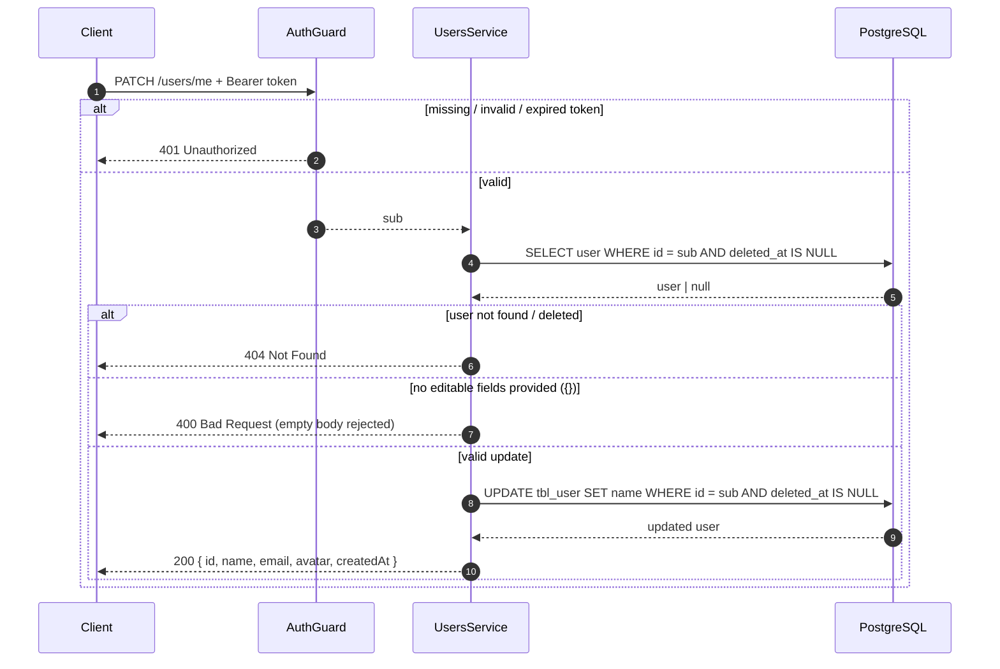
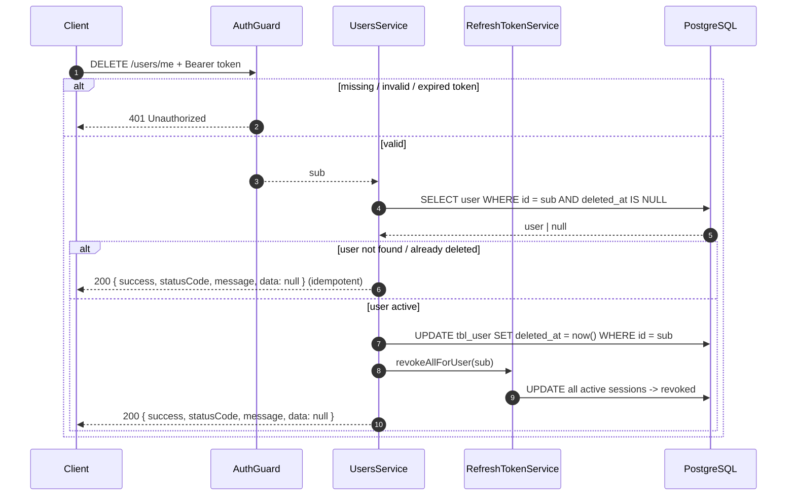

# 02 — Profile Management

Both endpoints are protected by `AuthGuard` — they require a valid `Authorization: Bearer <accessToken>` header and act on the caller's own account (`sub` from the token). The user's id never comes from the request body.

## Update profile (`PATCH /users/me`)

Payload (only `name` is editable; unknown fields are rejected with `400` by the global validation pipe):

```json
{ "name": "New Name" }
```

`name` must be 1–255 characters.



**Behavior notes**

- The response is the **mapped** user — `password` is never present.
- An empty body `{}` (or only `undefined` fields) is rejected with `400 Bad Request` — the API expects at least one field to update. A warning is logged so an empty `PATCH` is traceable (see [observability](03-observability.md)).
- The update query also filters `deleted_at IS NULL`, so an account deleted concurrently cannot be resurrected mid-request; such a request gets `404`.
- `avatar` is **not** editable — it is auto-generated from the email at registration.

## Delete account (`DELETE /users/me`)

Soft delete: flags the row with `deleted_at` and revokes every active refresh session. Returns the standard envelope with `data: null` (HTTP `200`).



**Behavior notes**

- **Idempotent by design**: deleting an already-deleted (or unknown) account still succeeds — a double-click or a stale token from a deleted account cannot cause an error. The response is `200` with `data: null` either way; a warning is logged server-side when nothing was actually deleted.
- **Immediate effect on sessions**: all refresh tokens are revoked in the same request, so the next refresh attempt fails with `401`. The client should drop local state and redirect to login.
- **Access token grace period**: the access token remains cryptographically valid for up to its TTL (15m), but any protected lookup (`/auth/me`, profile routes) returns `404` because the user is filtered out. This trade-off is shared with the auth system — see [auth security trade-offs](../auth/05-security.md).
- **After deletion**: login fails with the standard `401 Invalid credentials` (same dummy-hash timing defense as auth), and the email can be registered again.
- There is **no way to restore** a deleted account from the API — restore is an out-of-band database operation only.