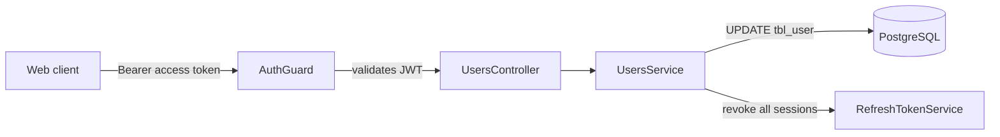

# Users Documentation

This folder documents the profile management system of the LinkVault API. It follows the same scenario-first style as the [auth docs](../auth/README.md): a new developer can understand **what happens** in each situation, **why**, and **how** to debug it.

## System at a glance

Profile management lives under `/users/*` and reuses the auth system for protection:

- Every endpoint is guarded by `AuthGuard` — a valid `Authorization: Bearer <accessToken>` header is required.
- There are exactly two capabilities: **update profile** (`PATCH /users/me`) and **delete account** (`DELETE /users/me`).
- Accounts are **soft deleted**: the row is flagged with `deleted_at`, never physically removed. All of the user's sessions are revoked in the same request.
- Avatars are auto-generated at registration (DiceBear, seeded by email) and are **not** editable.
- Registration also creates a default **General** collection for the user, inside the same transaction — see the [collections docs](../collections/README.md).

## Response envelope

Identical to the auth endpoints — every **success** response with a body is wrapped by the global `TransformInterceptor`:

```json
{
  "success": true,
  "statusCode": 200,
  "message": "Request successful",
  "data": { }
}
```

- `PATCH /users/me` uses a custom message: `User profile updated successfully`.
- `DELETE /users/me` returns the standard envelope with `data: null` (HTTP `200`) — there is no deleted object in the response.



## Documents

| Document | Covers |
| --- | --- |
| [01-overview.md](01-overview.md) | Components, data model, soft-delete invariants |
| [02-profile-management.md](02-profile-management.md) | Update profile, delete account — happy path and failures |
| [03-observability.md](03-observability.md) | What is logged in the users module, where, and why |

## How to read the flows

- Sequence diagrams show the exact request/response order between `Client → Controller → Service → DB`.
- `alt` / `opt` blocks mark conditional branches (the failure cases).
- Response payloads in the diagrams are the `data` field of the envelope described above.
- All diagrams are [Mermaid](https://mermaid.js.org) — rendered automatically on GitHub.
- For how the access token is validated and refreshed, see the [auth docs](../auth/README.md).